# Documento 18B – Diagrama ER (Mermaid)

## Versión 1 (ER Diagram V1)

Este diagrama representa el modelo relacional definido en el Documento 18 (DDL).
Puedes pegarlo en un visor Mermaid (por ejemplo, en un README o en herramientas compatibles).

```mermaid
erDiagram
  USERS ||--o{ USER_ROLES : has
  ROLES ||--o{ USER_ROLES : assigned

  USERS ||--o| TUTORS : profiles
  USERS ||--o| STUDENTS : profiles

  TUTORS ||--o{ STUDENT_TUTOR_LINKS : links
  STUDENTS ||--o{ STUDENT_TUTOR_LINKS : links

  ACADEMIC_YEARS ||--o{ TERMS : contains
  SUBJECTS ||--o{ TOPICS : contains
  TERMS ||--o{ TOPICS : scopes
  SUBJECTS ||--o{ MICROCONCEPTS : contains
  TERMS ||--o{ MICROCONCEPTS : scopes
  TOPICS ||--o{ MICROCONCEPTS : groups

  MICROCONCEPTS ||--o{ MICROCONCEPT_PREREQUISITES : requires
  MICROCONCEPTS ||--o{ MICROCONCEPT_PREREQUISITES : is_required_by

  STUDENTS ||--|| STUDENT_CONTEXT : has
  TERMS ||--o{ STUDENT_CONTEXT : active_term

  TUTORS ||--o{ CONTENT_UPLOADS : uploads
  STUDENTS ||--o{ CONTENT_UPLOADS : targets
  SUBJECTS ||--o{ CONTENT_UPLOADS : subject
  TERMS ||--o{ CONTENT_UPLOADS : term
  TOPICS ||--o{ CONTENT_UPLOADS : topic

  CONTENT_UPLOADS ||--o| CONTENT_EXTRACTIONS : extracted
  CONTENT_UPLOADS ||--o{ KNOWLEDGE_ENTRIES : produces
  KNOWLEDGE_ENTRIES ||--o{ KNOWLEDGE_CHUNKS : contains

  SUBJECTS ||--o{ ITEMS : subject
  TERMS ||--o{ ITEMS : term
  TOPICS ||--o{ ITEMS : topic
  MICROCONCEPTS ||--o{ ITEMS : microconcept
  KNOWLEDGE_ENTRIES ||--o{ ITEMS : source

  ITEMS ||--o{ ITEM_TAGS : tagged

  ACTIVITY_TYPES ||--o{ ACTIVITY_SESSIONS : type
  STUDENTS ||--o{ ACTIVITY_SESSIONS : plays
  ACTIVITY_SESSIONS ||--o{ ACTIVITY_SESSION_ITEMS : includes
  ITEMS ||--o{ ACTIVITY_SESSION_ITEMS : scheduled

  STUDENTS ||--o{ LEARNING_EVENTS : generates
  ACTIVITY_SESSIONS ||--o{ LEARNING_EVENTS : context
  ACTIVITY_TYPES ||--o{ LEARNING_EVENTS : context
  SUBJECTS ||--o{ LEARNING_EVENTS : scope
  TERMS ||--o{ LEARNING_EVENTS : scope
  TOPICS ||--o{ LEARNING_EVENTS : scope
  MICROCONCEPTS ||--o{ LEARNING_EVENTS : scope
  ITEMS ||--o{ LEARNING_EVENTS : about

  STUDENTS ||--o{ METRIC_AGGREGATES : aggregates
  STUDENTS ||--o{ MASTERY_STATES : mastery
  MICROCONCEPTS ||--o{ MASTERY_STATES : mastered

  RECOMMENDATION_CATALOG ||--o{ RECOMMENDATION_INSTANCES : defines
  STUDENTS ||--o{ RECOMMENDATION_INSTANCES : receives
  SUBJECTS ||--o{ RECOMMENDATION_INSTANCES : scope
  TERMS ||--o{ RECOMMENDATION_INSTANCES : scope
  TOPICS ||--o{ RECOMMENDATION_INSTANCES : scope
  MICROCONCEPTS ||--o{ RECOMMENDATION_INSTANCES : scope

  RECOMMENDATION_INSTANCES ||--o{ RECOMMENDATION_EVIDENCE : evidenced
  RECOMMENDATION_INSTANCES ||--o| TUTOR_DECISIONS : decided
  RECOMMENDATION_INSTANCES ||--o| RECOMMENDATION_OUTCOMES : evaluated

  TUTORS ||--o{ TUTOR_REPORTS : receives
  STUDENTS ||--o{ TUTOR_REPORTS : about
  TUTOR_REPORTS ||--o{ TUTOR_REPORT_SECTIONS : contains

  STUDENTS ||--o{ REAL_GRADES : has
  TUTORS ||--o{ REAL_GRADES : created
  REAL_GRADES ||--o{ ASSESSMENT_SCOPE_TAGS : tags
  TOPICS ||--o{ ASSESSMENT_SCOPE_TAGS : topic
  MICROCONCEPTS ||--o{ ASSESSMENT_SCOPE_TAGS : microconcept

  USERS ||--o{ AUDIT_LOGS : acts
```

